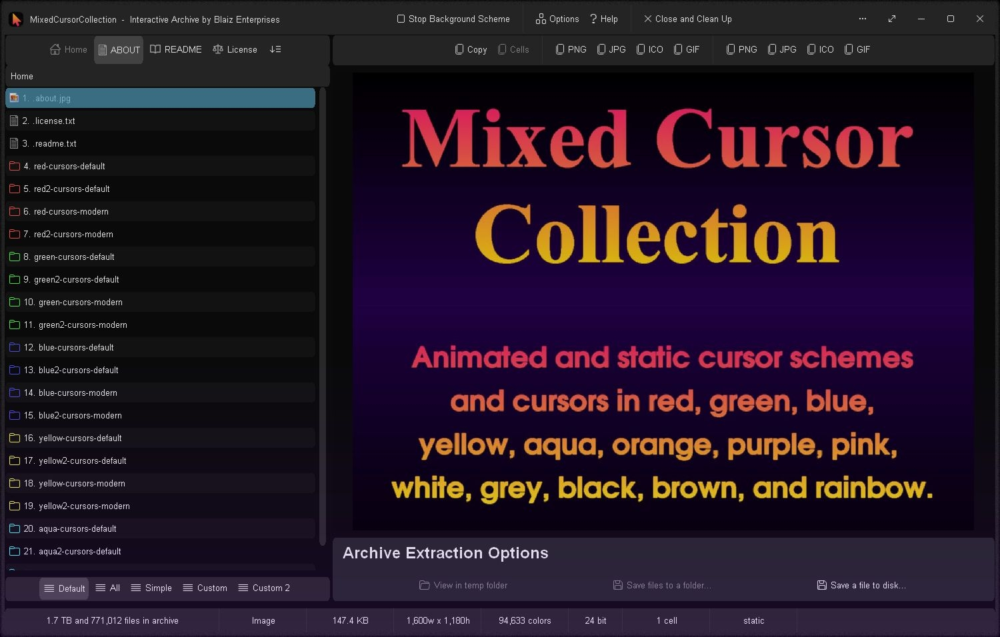
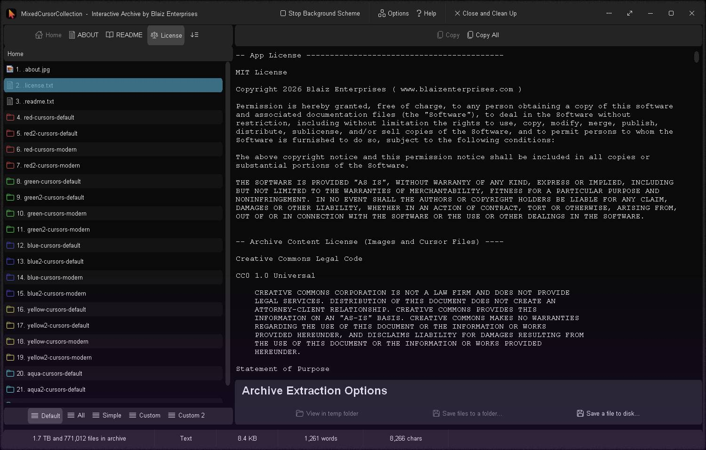
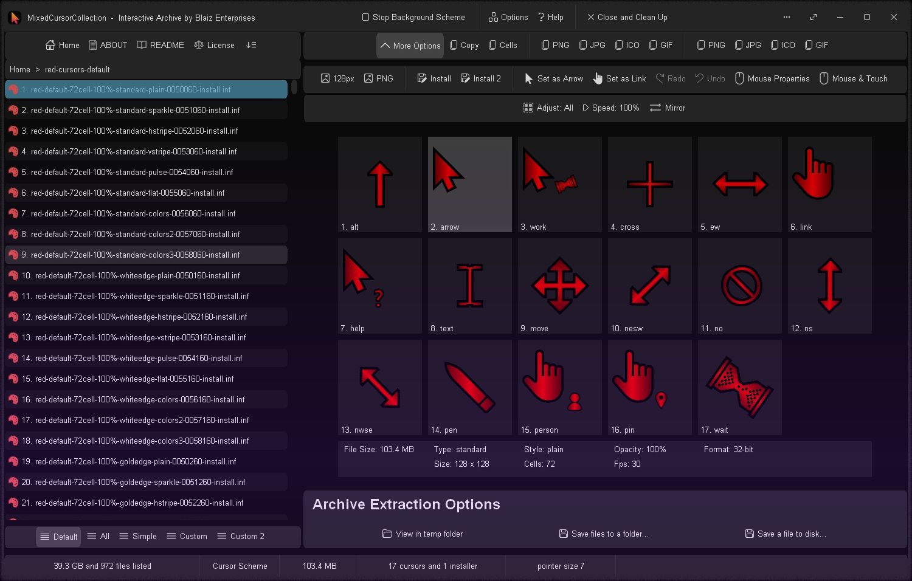
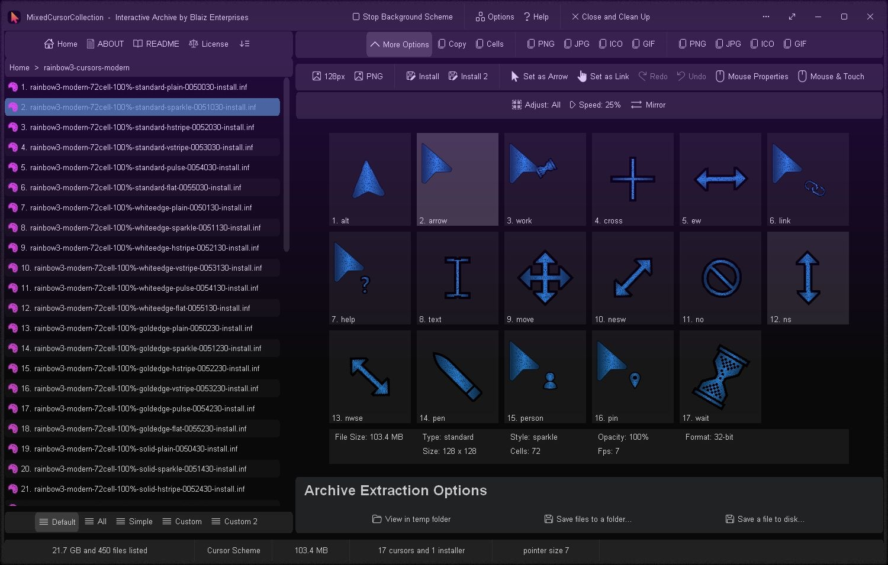
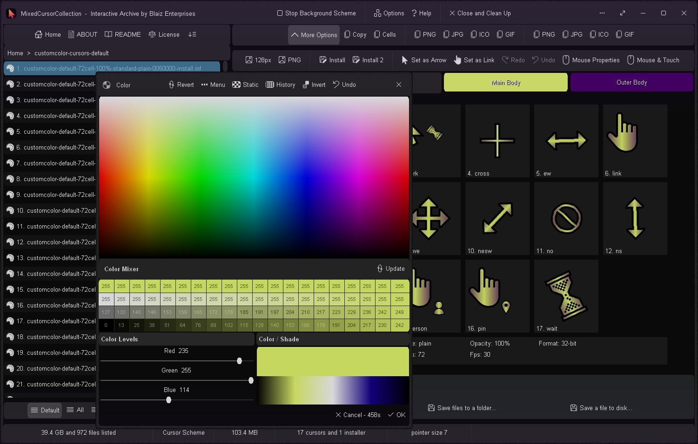
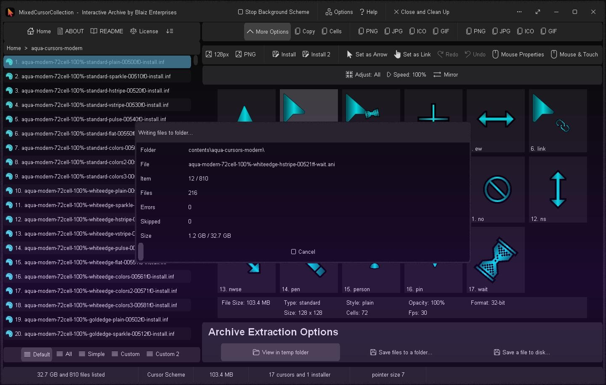
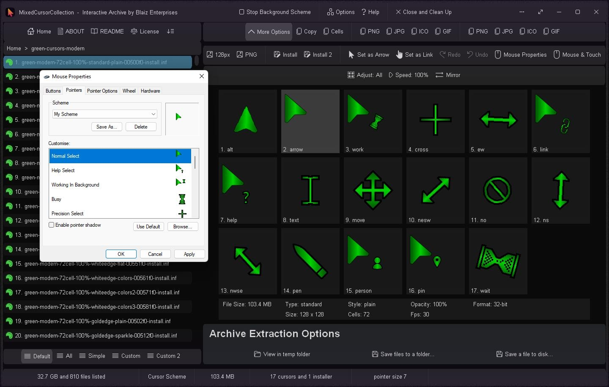

# MixedCursorCollection
771,000 animated and static cursor schemes and cursors in red, green, blue, yellow, aqua, orange, purple, pink, white, grey, black, brown, rainbow, and custom color.

This interactive archive contains a large number of multi-resolution (128 x 128 and 64 x 64) animated and static cursors that have been specially encoded using algorithmic techniques to pack ~771,000+ cursors / files and ~1.7 Tb (~118 Gb when the PNG format option is employed) of data into an ultra-compact app of ~2.2 Mb.

Each individual cursor scheme and/or single cursor can be easily previewed with the dedicated built-in file viewer.  A single cursor scheme - comprising of 17 cursors (".ani" or ".cur") and 1 installer script (".inf") - can be extracted to disk as a whole, or installed onto your computer for use with a predefined scheme name or a custom name of your choosing.  In addition, a folder's content can be extracted to disk.

The optimal mouse pointer size to view/use these cursors at is size 7 for large (128 x 128) and size 3 for small (64 x 64).  Though they will display effectively at any mouse pointer size.

# Features
* Rapid realtime view WYSIWYG (What You See Is What You Get) cursor scheme preview panel - view all 17 animated cursors at once at their native size and full frame rate of up to 60 fps
* Install: Install the current cursor scheme onto your computer with it's predefined name
* Install 2: Install the current cursor scheme on your computer with a custom name of your choosing
* Set as Arrow: Try out the current cursor as your "Normal Select/Arrow" cursor
* Set as Link:  Try out the current cursor as your "Link Select/Hand" cursor
* Redo and Undo: Redo and undo changes made by the "Set as Arrow/Link" options
* Mouse Properties: Click for quick access to the Windows "Mouse Properties" dialog
* Mouse & Touch: Click for quick access to the Windows "Mouse & Touch" settings page - Win10/11 only
* 2 Cursor Styles: Default - standard cursor shapes, and Modern - rounded pointer shapes
* 21 Static Colors: Red, red 2, green, green 2, blue, blue 2, yellow, yellow 2, aqua, aqua 2, orange, orange 2, purple, purple 2, pink, pink 2, white, grey, black, brown, and brown 2
* 5 Rainbow cursor styles
* 2 Custom color cursor styles - colorise individual cursors or all 17 at once with your own choice of colors
* 3 Opacity Levels: 100% (opaque), 75% (semi-transparent), and 50% (muted)
* 6 Types: Standard, White Edge, Gold Edge, Outline (excludes modern), Solid, and Tone
* 9 Styles: Plain, Sparkle, Horizontal Stripe, Vertical Stripe, Pulse, Flat, Colors, Colors 2, and Colors 3
* 5 Animation Runs: Ultra-smooth 72 cell @ 30 fps, smooth 48 cell @ 20 fps, normal 24 cell @ 10 fps, basic 16 cell @ 6 fps, and sub-basic 8 cell @ 3 fps when playback speed is set to 100%, and static
* 6 Global Speed Settings: 25%, 50%, 75%, 100% (default), 150%, and 200% - applies to all cursors in the archive
* 2 Global Display Modes: Normal and mirror for left-handed usage - applies to all cursors in the archive
* 2 Adjust Modes: All - adjust all 17 cursors in scheme, or One - adjust only the currently selected cursor within the scheme
* 2 Preview Sizes: 128px (128 x 128) and 64px (64 x 64)
* 5 Folder Mask Modes: Default - lists cursor schemes "*.inf", All - list all files, Simple - select from a list of file types, Custom and Custom 2 - type a series of multi-line complex masks to fine-tune the file list.  A mask is used to control which files are displayed and/or extracted on a per folder basis.
* 3 Extraction Methods: View in temp folder - one click fuss free + auto clean up, Save files to a folder..., and Save a file to disk...
* Option: Close and Clean Up - optionally discard the app's settings and temp files in order to leave no digital footprint behind
* Supported Cursor Formats: Animated Cursor (.ani) and static cursor (.cur) in DIB (uncompressed bitmap) or PNG (compressed portable network image)
* Cursor Color Depth: 32-bit RGBA
* Options Window - Easily change app color, font, and settings
* Portable
* Smart Source Code (Borland Delphi 3 and Lazarus 2.2/4.4/4.6)

# Codebase
* Source code supports both 32-bit and 64-bit
* 32-bit compilation in Borland Delphi 3 (stable)
* 32-bit compilation in Lazarus 2.2 (stable)
* 64-bit compilation in Lazarus 4.4/4.6 (functional/work in progress)
   
# Download
Download <a href="src/mixedcursorcollection.exe">mixedcursorcollection.exe</a> or from the "<a href="bin/">bin</a>" or "<a href="src/">src</a>" folders above - for Microsoft Windows, and Linux/MacOS via Wine.

# Images

App and Archive content licenses   

Default animated red cursor scheme   

Modern animated rainbow cursor scheme in a dark tint with sparkle effect   

Custom color animated cursor scheme with two custom colors applied - off-lime and purple   

Extracting files from the archive folder to a temporary folder   

A green cursor scheme installed onto the computer using the "Install 2" option with a custom name of "My Scheme" ready for use
